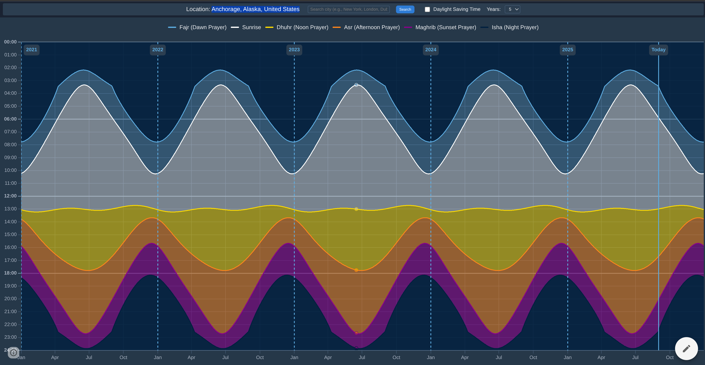
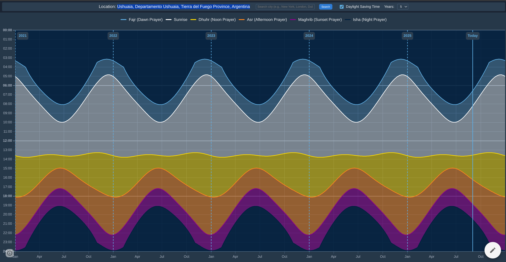

# Prayer Times Visualization 🕌

A beautiful, interactive web application that visualizes Muslim prayer times across multiple years using dynamic charts. Perfect for understanding prayer time patterns, seasonal variations, and the impact of geographical location on Islamic prayer schedules.

  

## ✨ Features

### 🌍 **Dynamic Location Search**
- **Real-time city search** with geocoding support
- **Global coverage** - works for any city worldwide
- **Smart fallback** to Mecca, Saudi Arabia as default location
- **No hardcoded cities** - uses OpenStreetMap's Nominatim service

### 📊 **Interactive Visualization**
- **Multi-year data** (1-5 years) with responsive chart sizing
- **Filled area charts** showing prayer time periods throughout the day
- **Smooth curves** with proper mathematical interpolation
- **Color-coded prayers** with distinct visual themes:
  - 🌅 **Fajr** (Dawn Prayer) - Light Blue (#5dade2)
  - ☀️ **Sunrise** - White (#ffffff)
  - 🌞 **Dhuhr** (Noon Prayer) - Yellow (#ffdc00)
  - 🌇 **Asr** (Afternoon Prayer) - Orange (#ff851b)
  - 🌆 **Maghrib** (Sunset Prayer) - Purple (#8b008b)
  - 🌙 **Isha** (Night Prayer) - Navy (#001f3f)

### 🕐 **Advanced Time Features**
- **Daylight Saving Time** toggle with smooth transitions
- **Accurate Islamic calculations** using established methods
- **Extreme latitude support** (Arctic/Antarctic regions)
- **Real-time tooltips** showing exact prayer times

### 🎨 **Dark Theme Design**
- **Eye-friendly dark interface** with charcoal backgrounds
- **Professional color palette** optimized for readability
- **Responsive design** works on desktop and mobile
- **Fullscreen visualization** for maximum chart clarity

## 🚀 Quick Start

### 🌐 **Option 1: Live Demo (Instant Access)**
**Try it now:** [https://sites.google.com/view/muslimprayertimesvisualization/](https://sites.google.com/view/muslimprayertimesvisualization/)

No download required - just open and start exploring prayer times worldwide!

### 📥 **Option 2: Direct Download**
1. Download `prayer-times-graph.html`
2. Open the file in any modern web browser
3. Allow location access or search for your city
4. Explore your prayer times!

### 💻 **Option 3: Local Development**
```bash
# Clone the repository
git clone https://github.com/melans/islamic-prayer-times-visualization.git
cd islamic-prayer-times-visualization

# Open in browser (no build process required)
open prayer-times-graph.html
# or
python -m http.server 8000  # Then visit http://localhost:8000
```

## 📖 How to Use

### 🔍 **Searching for Your Location**
1. **Enter your city** in the search box (e.g., "New York", "London", "Dubai")
2. **Press Enter** or click the "Search" button
3. **Wait for geocoding** - the app will find your city's coordinates
4. **Watch the data reload** with accurate prayer times for your location

### ⚙️ **Customizing the View**
- **Years Selector**: Choose 1-5 years of historical/future data
- **DST Toggle**: Enable/disable Daylight Saving Time adjustments
- **Interactive Chart**: Hover for exact prayer times, zoom and pan

### 🌍 **Understanding the Patterns**
- **Seasonal Curves**: Prayer times follow natural sunrise/sunset patterns
- **Latitude Effects**: Higher latitudes show more dramatic seasonal variations
- **Extreme Locations**: Arctic/Antarctic locations show spectacular mathematical patterns

### 🎭 **Showcase Examples - Mathematical Beauty in Nature**

Try these **extreme latitude locations** to see stunning prayer time patterns:


*Anchorage, Alaska showing dramatic Arctic sine waves*


*Ushuaia, Argentina showing gentle Antarctic curves (inverted seasons)*

#### 🏔️ **Anchorage, Alaska** (61°N - Arctic)
```
Search: Anchorage, Alaska, United States
```
- **Pattern**: Sharp, dramatic sine waves with extreme seasonal variations
- **Summer**: Fajr ~2:00 AM, Isha ~12:00 AM (white nights)  
- **Winter**: Fajr ~9:00 AM, Isha ~4:00 PM (polar darkness)
- **Visual**: Spectacular "mountain peak" curves showing Earth's axial tilt

#### 🐧 **Ushuaia, Argentina** (54°S - Antarctic)  
```
Search: Ushuaia, Departamento Ushuaia, Tierra del Fuego Province, Argentina
```
- **Pattern**: Gentle, inverted sine waves (Southern Hemisphere seasons)
- **Summer (Dec/Jan)**: Fajr ~4:00 AM, Isha ~11:00 PM
- **Winter (Jun/Jul)**: Fajr ~8:00 AM, Isha ~5:00 PM  
- **Visual**: Beautiful mathematical curves showing hemispheric opposition

#### 🌍 **Compare North vs South**
Open two browser windows and search for both locations to see:
- **Inverted seasonal patterns** - when Alaska has white nights, Ushuaia has polar darkness
- **Mathematical precision** - perfect sine wave opposites
- **Islamic adaptability** - prayer times naturally follow Earth's astronomy

## 🛠️ Technical Details

### **Architecture**
- **Single-page application** - everything in one HTML file
- **ES6 Class-based design** with modular organization
- **No build process required** - runs directly in browsers
- **Progressive enhancement** - works even on older browsers

### **APIs Used**
- **[Aladhan Prayer Times API](https://aladhan.com/prayer-times-api)** - Accurate Islamic prayer calculations
- **[Nominatim Geocoding](https://nominatim.org/)** - City name to coordinates conversion
- **Chart.js** - Interactive data visualization library

### **Data Processing**
- **Smart caching** prevents unnecessary API calls during DST toggles
- **Rate limiting** (50ms delays) respects API usage guidelines  
- **Error handling** with graceful fallbacks and user feedback
- **DST calculations** using US Daylight Saving Time rules

### **Browser Compatibility**
- ✅ **Chrome 80+**
- ✅ **Firefox 75+** 
- ✅ **Safari 13+**
- ✅ **Edge 80+**
- ⚠️ **Internet Explorer** - Not supported (requires ES6 features)

## 🔧 Customization

### **Changing Prayer Calculation Method**
The app uses **Method 2** (Islamic Society of North America) by default. To change:
```javascript
// In fetchPrayerTimes method, modify the URL:
const url = `https://api.aladhan.com/v1/calendar/${year}/${month}?latitude=${latitude}&longitude=${longitude}&method=1`;
// Methods: 1=University of Islamic Sciences, 2=ISNA, 3=MWL, etc.
```

### **Customizing Colors**
Update the prayer colors in the CSS variables:
```css
:root {
    --fajr-color: #5dade2;    /* Fajr - Light blue */
    --sunrise-color: #ffffff;  /* Sunrise - White */
    --dhuhr-color: #ffdc00;   /* Dhuhr - Yellow */
    --asr-color: #ff851b;     /* Asr - Orange */
    --maghrib-color: #8b008b; /* Maghrib - Purple */
    --isha-color: #001f3f;    /* Isha - Navy */
}
```

### **Adding New Features**
The modular `PrayerTimesApp` class makes it easy to extend:
- Add new visualization types
- Implement different calculation methods
- Add export functionality
- Create mobile-specific optimizations

## 📊 Data Sources & Accuracy

### **Prayer Time Calculations**
- Uses **astronomically accurate** sunrise/sunset calculations
- Follows **established Islamic jurisprudence** for prayer timing
- Handles **extreme latitudes** with appropriate adaptations
- Supports **multiple calculation methods** (ISNA, MWL, etc.)

### **Location Data**
- **OpenStreetMap** geocoding for global city coverage
- **Coordinate precision** to 4 decimal places (~11 meter accuracy)
- **Automatic fallback** to Mecca (21.3891°N, 39.8579°E) for reliability

### **Time Zone Handling**
- **Local time calculations** based on geographic coordinates
- **DST support** with US Daylight Saving Time rules
- **Manual DST toggle** for regions with different DST practices

## 🤝 Contributing

Contributions are welcome! Here are some ways to help:

### **Feature Ideas**
- [ ] Export prayer times to calendar formats (iCal, Google Calendar)
- [ ] Multiple calculation method selector
- [ ] Qibla direction indicator
- [ ] Prayer time notifications
- [ ] Different visualization types (line charts, heat maps)
- [ ] Mobile app version (React Native/Flutter)

### **Bug Reports**
Please include:
- Your browser version
- Geographic location (city/country)  
- Steps to reproduce the issue
- Console error messages (if any)

### **Pull Requests**
1. Fork the repository
2. Create a feature branch (`git checkout -b feature/amazing-feature`)
3. Make your changes
4. Test thoroughly in multiple browsers
5. Submit a pull request with detailed description

## 📜 License

This project is licensed under the **MIT License** - see the [LICENSE](LICENSE) file for details.

### **Third-party Libraries**
- **Chart.js** - MIT License
- **date-fns** - MIT License  
- **Aladhan API** - Free for non-commercial use
- **Nominatim** - ODbL License

## 🙏 Acknowledgments

- **[Aladhan](https://aladhan.com/)** for providing accurate Islamic prayer time calculations
- **[OpenStreetMap](https://openstreetmap.org/)** contributors for geocoding data
- **Chart.js team** for the excellent visualization library
- **Islamic scholars** whose work established the prayer time calculation methods
- **Extreme latitude communities** (Anchorage, Ushuaia, etc.) whose unique geographic positions showcase the mathematical beauty of Islamic prayer time adaptations

### 🤖 Development Partnership
This project represents a **human-AI collaboration**:
- **Human Vision:** [@melans](https://github.com/melans) - Project concept, Islamic requirements, user feedback, and community leadership
- **AI Implementation:** Claude (Anthropic) - Complete technical architecture, development, documentation, and strategic planning

**Together:** Meaningful purpose meets technical excellence, serving the global Muslim community while advancing educational understanding of Islamic astronomy.

## 📞 Support

- **🌐 Live Demo**: [sites.google.com/view/muslimprayertimesvisualization](https://sites.google.com/view/muslimprayertimesvisualization/) 
- **📚 Documentation**: Check the `/docs` folder for detailed technical documentation
- **🐛 Issues**: Report bugs and request features via GitHub Issues
- **💬 Discussions**: Join community discussions for usage questions

---

**Made with ❤️ for the global Muslim community**

*"And establish prayer at the two ends of the day and at the approach of the night. Indeed, good deeds do away with misdeeds." - Quran 11:114*